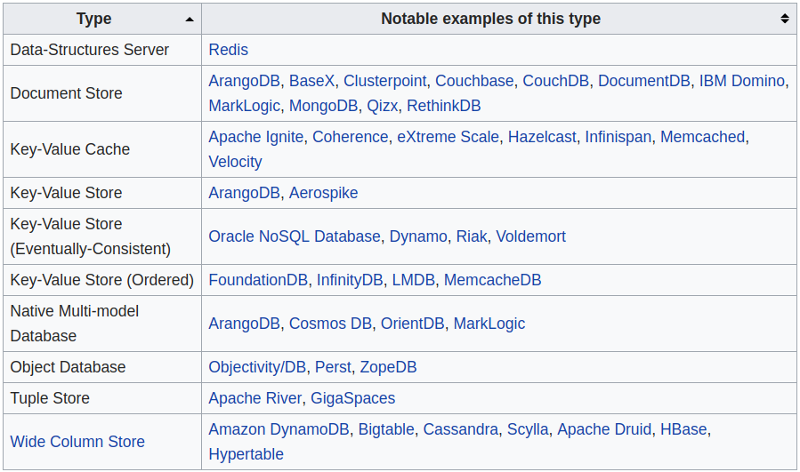

# Injection attacks in apps with NoSQL Backends

Note: Command to run this markdown as a slide using reveal-md `reveal-md README.md`


## About me

- Riyaz Walikar
- Offensive Security Lead at Appsecco
- @riyazwalikar / @wincmdfu
- One of the OWASP Bangalore Leads


## What are Injection attacks

- User-supplied data is not validated, filtered, or sanitized by the application.
- Dynamic queries or non-parameterized calls without context-aware escaping are used directly in the interpreter.
- Basically, occur when user input containing delimiters or context-aware escape characters is mixed with the interpreter code


## What is a NoSQL database?

- A NoSQL (originally referring to "non SQL" or "non relational") database provides a mechanism for storage and retrieval of data that is modeled in means other than the tabular relations used in relational databases.
- Most popular of them is MongoDB
- There are over 200 different types





## What is NoSQL Injection

- The most common examples on the Internet and the one that we will look at cover some of the `Document Store` type NoSQL backends
- A more correct description would be `Injection into apps with a NoSQL database backend of type Document Store`
- But it has been popularised as NoSQL Injection. Just be aware that this is inaccurate.


## Injection into MongoDB backed apps


### Pre-requisite for the attack to occur

- Application accepting user input that mixes with the code that creates the query in the app
- The application interacts with a MongoDB instance


### Some common signs to look out for during testing

- `Server` or `X-Powered-By` header has `Express`. An Express (NodeJS) app is often built with a MongoDB backend
- Content-Type is JSON or the POST body is JSON data
- If the Content-Type is `application/x-www-form-urlencoded`, changing it to `application/json` still allows the POST to succeed with POST data
- POST or GET parameters have array indices, i.e `user["name"]=baba&user["pass"]=paratha`


### Attack scenarios

- If POST body Content-Type is `application/json`, injection will likely be in both the name and value pairs
- If POST body Content-Type is `application/x-www-form-urlencoded`, injection will likely be in the parameter name via an array indice


### Example - Login Bypass

- Typical SQL query for login

```
SELECT * FROM users WHERE user = '$username' AND pass = '$password'
```

- Equivalent command in MongoDB

```
db.users.find({user: username, pass: password});
```


- Typical bypass for admin login in SQL RDBMS apps

```
SELECT * FROM users WHERE user = '' or 1 -- ' AND pass = '$password'
```

- Equivalent command in MongoDB

```
db.users.find({user: {"$gt":""}, pass: {"$gt":""}});
```

- Passing this via a POST

```
user[$gt]=&pass[$gt]=
```


## Demo

- Using the app from `https://github.com/websecurify/acme-no-login`


## Setup instructions for demo

```
git clone https://github.com/websecurify/acme-no-login.git
```

```
make docker-build
```

```
docker run --net=host -it acme-no-login /bin/sh -c 'make -f /app/Makefile _mn'
```


## References

- https://www.owasp.org/index.php/Top_10-2017_A1-Injection
- https://en.wikipedia.org/wiki/NoSQL
- http://nosql-database.org
- https://blog.websecurify.com/2014/08/hacking-nodejs-and-mongodb.html
- https://github.com/websecurify/acme-no-login
- https://github.com/swisskyrepo/PayloadsAllTheThings/tree/master/NoSQL%20Injection
- https://scotch.io/@401/mongodb-injection-in-nodejs
